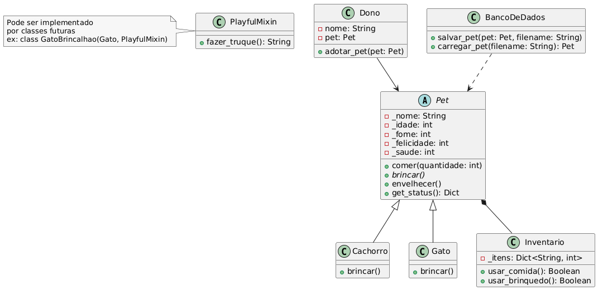

# Virtual Pet Simulator  

## Descrição do Problema  
Um simulador de pet virtual onde você pode adotar e cuidar de um animal.  

## Casos de Uso  
- Adotar um pet (cachorro ou gato).  
- Alimentar, brincar e ver status.  
- Salvar/carregar progresso.  

## Diagrama de Classes  
  

## Como Executar  
```bash
python main.py
